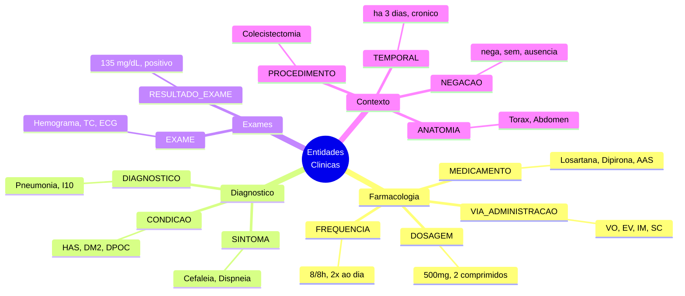
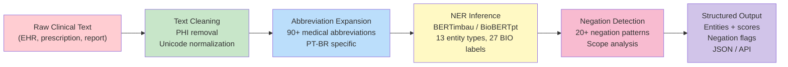

<div align="center">

# Clinical NLP Pipeline PT-BR

### Pipeline de Processamento de Linguagem Natural para Textos Clinicos em Portugues Brasileiro

[](https://python.org)
[](https://huggingface.co)
[](https://spacy.io)
[](https://fastapi.tiangolo.com)
[](https://pytorch.org)
[](https://docker.com)
[](LICENSE)
[](Dockerfile)

**Extracao de entidades medicas (NER) de prontuarios eletronicos, receituarios e laudos clinicos em portugues brasileiro usando BERTimbau e BioBERTpt. Reconhece 13 tipos de entidades clinicas com deteccao de negacao e expansao de 90+ abreviacoes medicas.**

[Portugues](#portugues) | [English](#english)

</div>

---

## Portugues

### Por que esse projeto existe

O NLP clinico em portugues brasileiro e um nicho praticamente vazio. A grande maioria das ferramentas de extracao de entidades medicas (NER) foi desenvolvida para ingles, e as poucas iniciativas em portugues sao academicas e fragmentadas — nao existem pipelines completos, de codigo aberto, prontos para uso em producao.

Esse gap tem impacto direto no mercado: health techs brasileiras, hospitais e operadoras de saude precisam extrair informacoes estruturadas de milhoes de prontuarios eletronicos escritos em portugues, com abreviacoes tipicas do contexto clinico brasileiro (pcte, HAS, DM2, VO, EV, 8/8h). Nao ha ferramenta pronta para isso.

Esse pipeline resolve o problema de ponta a ponta: do texto bruto do prontuario ate as entidades estruturadas, passando por limpeza, expansao de abreviacoes, inferencia via Transformer e deteccao de negacao — tudo otimizado para o portugues clinico brasileiro.

### Entidades Clinicas Suportadas

O pipeline reconhece **13 tipos de entidades clinicas**, cobrindo os cenarios mais frequentes em prontuarios eletronicos brasileiros:



| Entidade | Descricao | Exemplos |
|----------|-----------|----------|
| **MEDICAMENTO** | Farmacos, principios ativos, nomes comerciais | Losartana, Metformina, Dipirona, AAS |
| **DOSAGEM** | Quantidade e unidade de dose | 500mg, 2 comprimidos, 10ml, 40UI |
| **FREQUENCIA** | Posologia e horarios | 8/8h, 2x ao dia, pela manha, SN |
| **VIA_ADMINISTRACAO** | Rota de administracao | via oral (VO), endovenoso (EV), IM, SC |
| **DIAGNOSTICO** | Diagnosticos clinicos e CID-10 | Pneumonia, Hipertensao arterial, I10 |
| **PROCEDIMENTO** | Cirurgias e procedimentos | Colecistectomia, Hemodialise, Intubacao |
| **SINTOMA** | Queixas e manifestacoes | Cefaleia, Dispneia, Dor toracica, Febre |
| **EXAME** | Exames solicitados/realizados | Hemograma, Glicemia, TC de cranio, ECG |
| **RESULTADO_EXAME** | Valores de resultados | 135 mg/dL, positivo, 12.5 g/dL |
| **ANATOMIA** | Partes do corpo e orgaos | Torax, Abdomen, Membro inferior esquerdo |
| **CONDICAO** | Doencas cronicas e comorbidades | HAS, DM2, DPOC, ICC, Asma |
| **TEMPORAL** | Marcos temporais | ha 3 dias, desde 2020, por 7 dias, cronico |
| **NEGACAO** | Marcadores de negacao clinica | nega, sem, ausencia de, nao apresenta |

### Arquitetura do Pipeline

```mermaid
flowchart TB
    subgraph Input["Entrada"]
        A["Texto Clinico Bruto\n(prontuario, receituario, laudo)"]
    end

    subgraph Preprocessing["1. Preprocessamento"]
        B["ClinicalTextCleaner\nRemocao de PHI (CPF, tel, email)\nNormalizacao Unicode\nNormalizacao de dosagens"]
        C["AbbreviationExpander\n90+ abreviacoes medicas PT-BR\npcte→paciente, HAS→hipertensao\nVO→via oral, DM2→diabetes tipo 2"]
    end

    subgraph NER["2. Extracao de Entidades (NER)"]
        D["Tokenizacao\nBERTimbau / BioBERTpt Tokenizer"]
        E["Inferencia Transformer\nToken Classification\n27 labels BIO (13 entidades x B/I + O)"]
        F["Agregacao BIO\nB-MEDICAMENTO + I-MEDICAMENTO\n→ MEDICAMENTO completo"]
    end

    subgraph PostProcess["3. Pos-Processamento"]
        G["NegationDetector\n20+ padroes de negacao PT-BR\nPre-negacao: nega, sem, ausencia\nPos-negacao: foi descartado\nPseudo-negacao: sem melhora"]
        H["Normalizacao de Entidades\nScore filtering\nMetadata enrichment"]
    end

    subgraph Output["4. Saida"]
        I["PipelineResult\n- entities[]: lista estruturada\n- negations[]: marcadores\n- entity_summary: contagem\n- processing_time_ms"]
    end

    subgraph API["API REST (FastAPI)"]
        J["POST /analyze\nPOST /analyze/batch\nGET /entities\nGET /health"]
    end

    A --> B --> C --> D --> E --> F --> G --> H --> I
    I --> J

    style Input fill:#e3f2fd,stroke:#1565c0
    style Preprocessing fill:#e8f5e9,stroke:#2e7d32
    style NER fill:#fff8e1,stroke:#f57f17
    style PostProcess fill:#fce4ec,stroke:#880e4f
    style Output fill:#f3e5f5,stroke:#7b1fa2
    style API fill:#e0f2f1,stroke:#00695c
```



### Modelos Suportados

| Modelo | Dominio | Tokens de Treino | Uso Recomendado |
|--------|---------|------------------|-----------------|
| **[BERTimbau](https://huggingface.co/neuralmind/bert-base-portuguese-cased)** | Portugues geral | 2.7B tokens (BrWaC) | Fine-tuning inicial, baseline |
| **[BioBERTpt](https://huggingface.co/pucpr/biobertpt-all)** | Clinico/biomedico PT | 44.1M tokens clinicos | Melhor performance em texto medico |

### Exemplo de Uso Real

```python
from src.ner.pipeline import ClinicalNERPipeline

# Inicializar e carregar modelo
pipeline = ClinicalNERPipeline(
    model_name="neuralmind/bert-base-portuguese-cased"
)
pipeline.load()

# Texto de prontuario real (anonimizado)
texto = """
Paciente masculino, 67 anos, portador de hipertensao arterial
sistemica e diabetes mellitus tipo 2. Em uso de Losartana 50mg
via oral 1x ao dia e Metformina 850mg via oral 2x ao dia.
Nega tabagismo. Hemograma e glicemia de jejum dentro da
normalidade. Creatinina 1.1 mg/dL.
"""

# Processar
result = pipeline.process(texto)

# Resultado
for entity in result.entities:
    neg = " [NEGADO]" if entity.negated else ""
    print(f"  {entity.text:30s} | {entity.label:20s} | {entity.score:.2f}{neg}")
```

**Saida esperada:**

```
  hipertensao arterial sistemica | CONDICAO             | 0.97
  diabetes mellitus tipo 2       | CONDICAO             | 0.96
  Losartana                      | MEDICAMENTO          | 0.99
  50mg                           | DOSAGEM              | 0.95
  via oral                       | VIA_ADMINISTRACAO    | 0.93
  1x ao dia                      | FREQUENCIA           | 0.91
  Metformina                     | MEDICAMENTO          | 0.98
  850mg                          | DOSAGEM              | 0.94
  via oral                       | VIA_ADMINISTRACAO    | 0.93
  2x ao dia                      | FREQUENCIA           | 0.90
  tabagismo                      | CONDICAO             | 0.88 [NEGADO]
  Hemograma                      | EXAME                | 0.94
  glicemia de jejum              | EXAME                | 0.92
  Creatinina                     | EXAME                | 0.96
  1.1 mg/dL                      | RESULTADO_EXAME      | 0.89
```

### API REST

```bash
# Subir a API
uvicorn src.api.app:app --port 8000

# Ou com Docker
docker-compose -f deployment/docker-compose.yml up -d

# Analisar texto clinico
curl -X POST http://localhost:8000/analyze \
  -H "Content-Type: application/json" \
  -d '{
    "text": "Pcte com HAS em uso de Losartana 50mg VO 1x/dia. Nega DM.",
    "expand_abbreviations": true,
    "detect_negations": true
  }'
```

**Resposta:**

```json
{
  "original_text": "Pcte com HAS em uso de Losartana 50mg VO 1x/dia. Nega DM.",
  "cleaned_text": "paciente com hipertensao arterial sistemica em uso de Losartana 50mg via oral 1x/dia. Nega diabetes mellitus.",
  "entities": [
    {"text": "hipertensao arterial sistemica", "label": "CONDICAO", "start": 13, "end": 43, "score": 0.97, "negated": false},
    {"text": "Losartana", "label": "MEDICAMENTO", "start": 55, "end": 64, "score": 0.99, "negated": false},
    {"text": "50mg", "label": "DOSAGEM", "start": 65, "end": 69, "score": 0.95, "negated": false},
    {"text": "via oral", "label": "VIA_ADMINISTRACAO", "start": 70, "end": 78, "score": 0.93, "negated": false},
    {"text": "1x/dia", "label": "FREQUENCIA", "start": 79, "end": 85, "score": 0.91, "negated": false},
    {"text": "diabetes mellitus", "label": "CONDICAO", "start": 92, "end": 109, "score": 0.88, "negated": true}
  ],
  "entity_count": 6,
  "entity_summary": {"CONDICAO": 2, "MEDICAMENTO": 1, "DOSAGEM": 1, "VIA_ADMINISTRACAO": 1, "FREQUENCIA": 1},
  "processing_time_ms": 87.3,
  "model_name": "neuralmind/bert-base-portuguese-cased"
}
```

### Endpoints da API

| Metodo | Endpoint | Descricao |
|--------|----------|-----------|
| `POST` | `/analyze` | Extrair entidades de texto unico |
| `POST` | `/analyze/batch` | Extrair entidades de ate 100 textos |
| `GET` | `/entities` | Listar tipos de entidades suportadas |
| `GET` | `/health` | Health check do servico |
| `GET` | `/docs` | Documentacao interativa (Swagger UI) |
| `GET` | `/redoc` | Documentacao alternativa (ReDoc) |

### Dicionario de Abreviacoes

O pipeline inclui **90+ abreviacoes medicas** brasileiras com expansao automatica:

| Categoria | Exemplos |
|-----------|----------|
| **Prontuario** | pcte→paciente, dx→diagnostico, hda→historia da doenca atual |
| **Vias de administracao** | VO→via oral, EV→endovenoso, IM→intramuscular, SC→subcutaneo |
| **Posologia** | bid→2x/dia, tid→3x/dia, SN→se necessario, ACM→a criterio medico |
| **Condicoes** | HAS→hipertensao arterial, DM2→diabetes tipo 2, DPOC, IAM, AVC, ICC |
| **Sinais vitais** | FC→frequencia cardiaca, FR→respiratoria, PA→pressao arterial, Sat→saturacao |
| **Exames** | Hb→hemoglobina, Cr→creatinina, ECG, TC, RM, USG |
| **Anatomia** | MMII→membros inferiores, MMSS→superiores, Abd→abdomen |

### Inicio Rapido

```bash
# 1. Clonar
git clone https://github.com/galafis/clinical-nlp-pipeline-ptbr.git
cd clinical-nlp-pipeline-ptbr

# 2. Ambiente virtual
python -m venv venv
source venv/bin/activate  # Windows: venv\Scripts\activate
pip install -r requirements.txt

# 3. Rodar demo (sem modelo — mostra preprocessamento e negacao)
python examples/quickstart.py

# 4. Rodar API (com modelo — requer download do BERTimbau ~400MB)
uvicorn src.api.app:app --port 8000
# Acesse: http://localhost:8000/docs

# 5. Rodar testes
pytest tests/ -v --tb=short
```

### Estrutura do Projeto

```
clinical-nlp-pipeline-ptbr/
├── src/
│   ├── ner/                          # Core NER
│   │   ├── entity_types.py           # 13 entidades + BIO labels (27 labels)
│   │   ├── clinical_ner.py           # Modelo Transformer (train + predict)
│   │   └── pipeline.py               # Pipeline integrado
│   ├── preprocessing/                # Preprocessamento
│   │   ├── text_cleaner.py           # Limpeza + anonimizacao PHI
│   │   ├── abbreviation_expander.py  # 90+ abreviacoes medicas
│   │   └── negation_detector.py      # 20+ padroes de negacao
│   ├── api/                          # API REST
│   │   └── app.py                    # FastAPI (6 endpoints)
│   └── utils/                        # Utilitarios
├── tests/
│   ├── test_preprocessing.py         # 20+ testes de preprocessamento
│   ├── test_entity_types.py          # 10+ testes de entidades/labels
│   └── test_api.py                   # 15+ testes de API
├── data/
│   └── annotations/
│       └── exemplo_prontuario.jsonl  # 5 prontuarios anotados (ground truth)
├── config/
│   └── settings.yaml                 # Configuracoes do pipeline
├── deployment/
│   ├── Dockerfile                    # Container da API
│   └── docker-compose.yml            # Stack completa
├── examples/
│   └── quickstart.py                 # Demo executavel
├── requirements.txt                  # 30+ dependencias
├── .env.example                      # Variaveis de ambiente
└── LICENSE
```

### Aplicacoes Comerciais

- **Prontuario Eletronico (PEP)** — Estruturar milhoes de notas clinicas em dados tabulares para analytics
- **Auditoria de Contas Medicas** — Extrair procedimentos e medicamentos automaticamente para conferencia
- **Farmacovigilancia** — Detectar reacoes adversas a medicamentos em relatos clinicos
- **Pesquisa Clinica** — Selecao de pacientes para trials baseada em criterios extraidos de prontuarios
- **Business Intelligence Hospitalar** — Dashboards de morbidade, prescricao e outcomes
- **Operadoras de Saude** — Auditoria automatizada de guias e autorizacoes

### Referencias Academicas

Este projeto foi desenvolvido com base nas seguintes referencias:

- **SemClinBr** — Corpus clinico anotado em portugues (HAILab-PUCPR, 1000 notas, 65k entidades)
- **BioBERTpt** — BERT clinico/biomedico para portugues (44.1M tokens clinicos)
- **BERTimbau** — BERT pre-treinado em portugues brasileiro (neuralmind, 2.7B tokens)
- **NegEx** — Algoritmo de deteccao de negacao adaptado para PT-BR (Chapman et al., 2001)

---

## English

### About the Project

Clinical NLP in Brazilian Portuguese is a virtually empty niche. Most medical entity extraction tools (NER) were built for English, and the few Portuguese initiatives are academic and fragmented — there are no complete, open-source, production-ready pipelines available.

This pipeline solves the problem end-to-end: from raw clinical text to structured entities, including text cleaning, abbreviation expansion, Transformer inference, and negation detection — all optimized for Brazilian clinical Portuguese.

### Processing Pipeline



### Key Features

- **13 Clinical Entity Types** — Medications, dosages, frequencies, routes, diagnoses, procedures, symptoms, exams, results, anatomy, conditions, temporal markers, negation cues
- **Brazilian Portuguese Optimized** — 90+ medical abbreviations (pcte, HAS, DM2, VO, EV), clinical negation patterns (nega, sem, ausencia de), dosage normalization
- **Transformer-Based NER** — BERTimbau (general PT-BR) and BioBERTpt (clinical/biomedical PT) with BIO tagging (27 labels)
- **Clinical Negation Detection** — 20+ pre/post negation patterns with scope analysis, pseudo-negation filtering
- **Production-Ready API** — FastAPI with Swagger UI, batch processing, health check, Pydantic validation
- **PHI De-identification** — Automatic removal of CPF, phone numbers, emails from clinical text
- **Docker-Ready** — Single-command deployment with Docker Compose
- **5 Annotated Examples** — Ground truth dataset with real clinical scenarios (admission notes, prescriptions, ICU notes, cardiology follow-up)

### Supported Entity Types

| Entity | Description | Examples |
|--------|-------------|----------|
| **MEDICAMENTO** | Drugs and active ingredients | Losartana, Metformin, Dipyrone |
| **DOSAGEM** | Dose amounts and units | 500mg, 2 tablets, 10ml |
| **FREQUENCIA** | Administration frequency | Every 8h, twice daily, morning |
| **VIA_ADMINISTRACAO** | Administration route | Oral (VO), IV (EV), IM, SC |
| **DIAGNOSTICO** | Clinical diagnoses, ICD-10 | Pneumonia, Hypertension, I10 |
| **PROCEDIMENTO** | Surgeries and procedures | Cholecystectomy, Hemodialysis |
| **SINTOMA** | Symptoms and complaints | Headache, Dyspnea, Chest pain |
| **EXAME** | Lab and imaging tests | CBC, Blood glucose, CT scan |
| **RESULTADO_EXAME** | Test result values | 135 mg/dL, positive, normal |
| **ANATOMIA** | Body parts and organs | Chest, Abdomen, Lower limbs |
| **CONDICAO** | Chronic conditions | Hypertension, Type 2 Diabetes |
| **TEMPORAL** | Time references | 3 days ago, since 2020, chronic |
| **NEGACAO** | Clinical negation markers | denies, absence of, without |

### Quick Start

```bash
git clone https://github.com/galafis/clinical-nlp-pipeline-ptbr.git
cd clinical-nlp-pipeline-ptbr

python -m venv venv && source venv/bin/activate
pip install -r requirements.txt

# Run demo (no model download needed)
python examples/quickstart.py

# Run API (requires BERTimbau download ~400MB)
uvicorn src.api.app:app --port 8000

# Run tests
pytest tests/ -v
```

### Tech Stack

| Layer | Technology | Purpose |
|-------|-----------|---------|
| **NLP Models** | Hugging Face Transformers, BERTimbau, BioBERTpt | Clinical NER inference |
| **Deep Learning** | PyTorch | Model training and inference |
| **API** | FastAPI, Uvicorn, Pydantic | REST API with auto-docs |
| **Preprocessing** | Custom PT-BR pipeline | Text cleaning, abbreviations, negation |
| **Testing** | pytest, httpx | Unit and integration tests |
| **Deploy** | Docker, Docker Compose | Containerized deployment |
| **Quality** | black, flake8, mypy | Code formatting and type checking |

### Commercial Applications

- **Electronic Health Records** — Structure millions of clinical notes into tabular data
- **Medical Billing Audit** — Auto-extract procedures and medications for verification
- **Pharmacovigilance** — Detect adverse drug reactions in clinical reports
- **Clinical Research** — Patient selection for trials based on extracted criteria
- **Hospital BI** — Morbidity, prescription, and outcomes dashboards
- **Health Insurance** — Automated audit of medical authorizations

### License

MIT License — see [LICENSE](LICENSE) for details.

### Author

**Gabriel Demetrios Lafis**
- GitHub: [@galafis](https://github.com/galafis)
- LinkedIn: [Gabriel Demetrios Lafis](https://linkedin.com/in/gabriel-demetrios-lafis)
</div>
